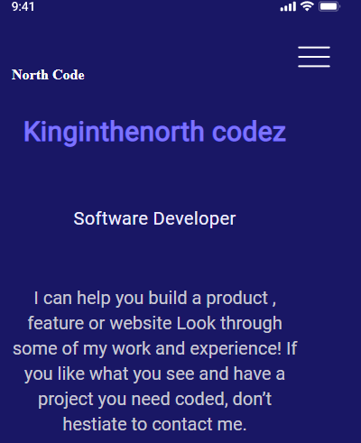

# My Portifolio

> A Project detailing about me and my works.
> Everything about bots and nuts

## Built With

- HTML 5
- CSS
- Linters

## Live Demo (available)
Feel free to check the [Live Demo](https://kinginthenorthcodez.github.io/North-portifolio/)

## Installation

If you installed git you can clone the code to your machine, or download a ZIP of all the files directly.

Download the ZIP from this location, or run the following git command to clone the files to your machine:

git clone https://github.com/kinginthenorthcodez/North-portifolio.git
Once the files are on your machine, open the portafolio folder in Visual Studio Code.

With the files open in Visual Studio Code, press the Go Live button at the bottom of the window to launch the files with Live Server.

## Authors

👤 **Author1**

- GitHub: [@kinginthenorthcodez](https://github.com/kinginthenorthcodez)

## 🤝 Contributing

Contributions, issues, and feature requests are welcome!

Feel free to check the [issues page](https://github.com/kinginthenorthcodez/North-portifolio/issues).

## Show your support

Give a ⭐️ if you like this project!

## Acknowledgments

-My coding Parters
- code Reviewers
-google & stackoverflow
-open source community

## 📝 License

This project is [MIT](./MIT.md) licensed.
